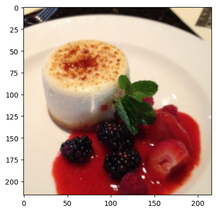
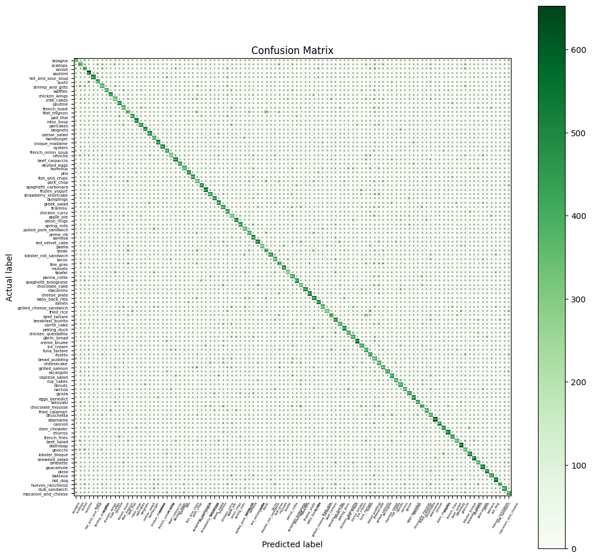

# Food-101 Image Classification

**Author**: Sevendi Eldrige Rifki Poluan

A deep learning project for food image classification using transfer learning with EfficientNetB7.

## Project Overview

This project focuses on image classification methods utilizing **transfer learning techniques** with the EfficientNetB7 model pre-trained on ImageNet. The model employs a hybrid approach where some layers are frozen while others are fine-tuned for weight updates during training.

### Dataset

- **Name**: Food-101
- **Classes**: 101 food categories
- **Total Images**: 101,000 images
- **Train/Test Split**: 750 training images + 250 manually reviewed test images per class
- **Image Resolution**: Maximum side length of 512 pixels (rescaled by dataset authors)
- **Dataset Source**: [ETH Food-101 Dataset](https://data.vision.ee.ethz.ch/cvl/datasets_extra/food-101/)

## Requirements

- Python 3.7+
- TensorFlow 2.x
- scikit-learn
- NumPy
- Matplotlib

## Installation

1. Clone the repository:
```bash
git clone <repository-url>
cd food-101-classification
```

2. Create a virtual environment:
```bash
python -m venv .venv
```

3. Activate the virtual environment:
```bash
# On macOS/Linux
source .venv/bin/activate

# On Windows
.venv\Scripts\activate
```

4. Install dependencies:
```bash
pip install -r requirements.txt
```

3. Download the Food-101 dataset and extract it to the project root directory:
```
food-101-classification/
├── food-101/
│   └── images/
│       ├── apple_pie/
│       ├── baby_back_ribs/
│       └── ...
```

## Usage

### Training

Run the main training script:
```bash
python food-101.py
```

### Jupyter Notebook

For interactive exploration and experimentation:
```bash
jupyter notebook Food-101.ipynb
```

## Model Architecture

- **Base Model**: EfficientNetB7 (pre-trained on ImageNet)
- **Input Size**: 224×224 pixels
- **Batch Size**: 16
- **Training Strategy**: Fine-tuning with layer freezing/unfreezing

## Results

### Sample Food Image


### Confusion Matrix


**Model Performance**: Achieves up to 70% accuracy on the Food-101 test dataset with the basic EfficientNetB7 architecture.

## References

- **Food-101 Dataset**: [Learning a Deep Convolutional Network for Image Classification](https://data.vision.ee.ethz.ch/cvl/datasets_extra/food-101/)
  - Official dataset: ETH Food-101 | 101 Food Categories & 101,000 Images

- **EfficientNet**: [Mingxing Tan & Quoc V. Le, EfficientNet: Rethinking Model Scaling for Convolutional Neural Networks](https://arxiv.org/abs/1905.11946)

- **Transfer Learning**: [Jason Yosinski et al., How transferable are features in deep neural networks?](https://arxiv.org/abs/1411.1792)

- **TensorFlow & Keras**: [Keras Documentation](https://keras.io/)
